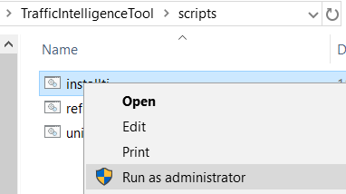
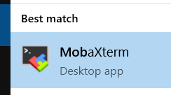
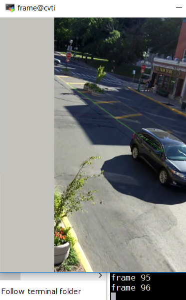

# Traffic Intelligence Tools
Turn key solution of compilation and deployment of [Traffic Intelligence Tools](https://bitbucket.org/Nicolas/trafficintelligence/wiki/Home) with opencv 3.4.3 on Windows platform.

## Install required programs
After clone the project, you need to run the [install script](https://github.com/PSUTrec/TrafficIntelligenceTool/blame/master/scripts/installti.bat) as Administrator. 


### Following programs will be installed onto your windows system:
- git -- for code download
- vagrant -- virtualbox VM manager
- virtualbox -- ubuntu 16.04 virtual machine
- mobaxterm -- running X-app on windows

### Compiling opencv 3.4.3 and Traffic Intelligence 
After required app installed, the script will create a directory `cvtivm` at the parent folder and copy bootstrap files to start a Ubuntu 16.04 VM as a host to compile opencv and traffic intelligence software. 

The compilation usually will take **3-5 hours**. After compilation is done opencv 3.4.3 and traffic intelligence debian installation packages will be created and copied to the release folder. Those packages can be installed on ubuntu 16.04 platform. 

### Using traffic intelligence on windows
Inside the `cvtivm` folder three directories are created:
- release -- compiled ubuntu packages copied here
- test -- traffic intelligence test package
- jupyter -- jupyter notebook sample for traffic intelligence
`test` and `jupyter` folders are mirrored (shared) in the virtual machine. 
#### Run display-trajectories.py demo
The display-trajectories.py demo has GUI element. We need to use mobaxterm to start a X server then login into the VM using ssh-config.
If in the directory, `vagrant-ssh` is not there, you need to generate with following command:
- generate vagrant-ssh
```
vagrant ssh-config>vagrant-ssh
```
- vagrant-ssh sample:
```
Host cvti
  HostName 127.0.0.1
  User vagrant
  Port 2222
  UserKnownHostsFile /dev/null
  StrictHostKeyChecking no
  PasswordAuthentication no
  IdentityFile /cygdrive/c/dev/TrafficIntelligenceTool/cvtivm/.vagrant/machines/cvti/virtualbox/private_key
  IdentitiesOnly yes
  LogLevel FATAL
  ForwardAgent yes
  ForwardX11 yes
```
- Launch mobaxterm launch a local term (x server will start automatically on windows)
mobaxterm 
- find the directory where you have your virutal machine running, in my case `/drive/c/dev/TrafficIntelligenceTool/cvtivm`
- ssh into the VM with X-forward usig following command
```
ssh -F vagrant-ssh cvti
```
 - here `cvti` is the host name specified in the vagrant-ssh configuration file
- unzip the demo at ~/test/
```
unzip 12-laurier.zip
cd 12-laurier
```
- Launch the demo with following command:
```
display-trajectories.py --cfg tracking.cfg -i laurier.avi -d laurier.sqlite -o homography.txt -t object
```
 - A video screen will pop up with the first frame, mouse select the frame and hit return and each return key hit will load a frame from the video and draw trajectory information on the video frame.


## Jupyter notebook sample
[A jupyter notebook](https://github.com/PSUTrec/TrafficIntelligenceTool/blob/master/etc/jupyter/ti_sample.ipynb) is at the jupyter shared directory. Launch your browser and access the sample at http:cvti.example.com:8888
